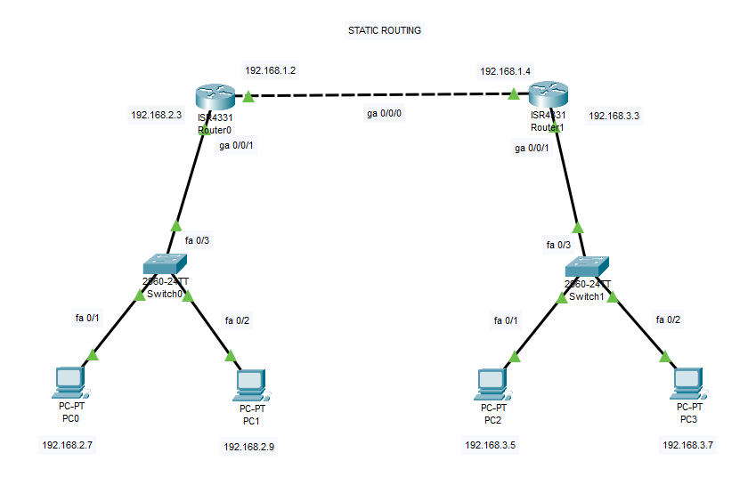
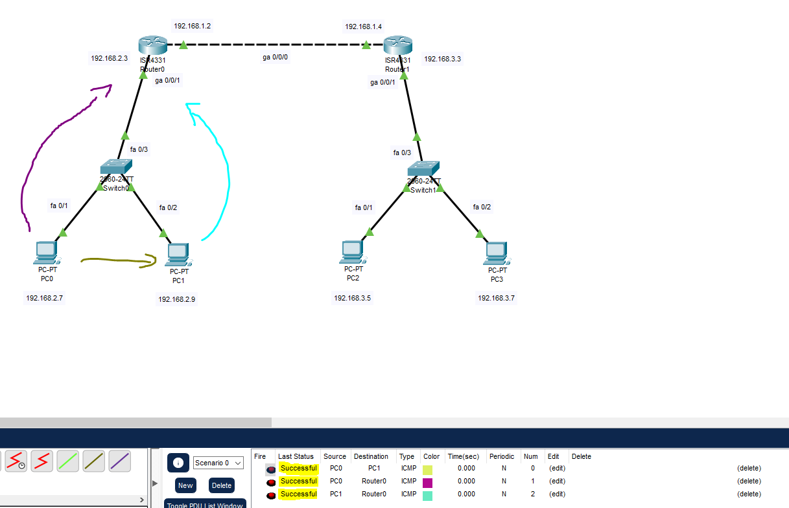
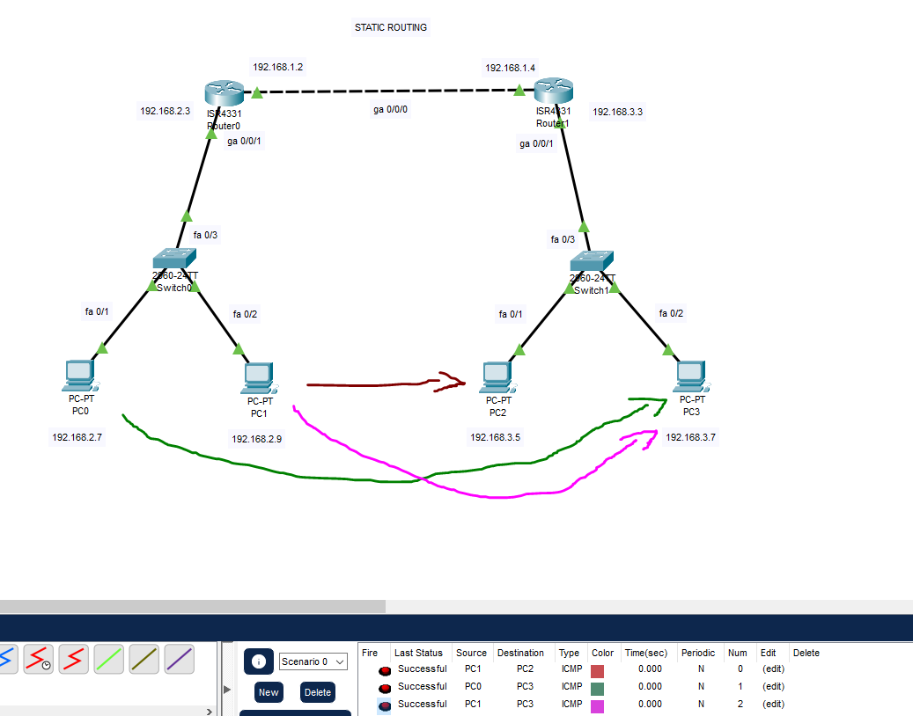
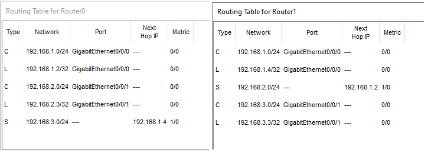

# Static-Routing-CiscoPT-Lab

## Cel Laboratorium

Celem tego laboratorium jest zapoznanie się z podstawową konfiguracją routingu statycznego na routerach Cisco w środowisku symulacyjnym Cisco Packet Tracer. Skonfigurujemy sieć składającą się z dwóch podsieci połączonych routerami i ustawimy trasy statyczne, aby umożliwić komunikację między hostami w różnych podsieciach.

## Topologia Sieci

Poniższy schemat przedstawia topologię sieci, którą będziemy konfigurować:



* **Router0:** Połączony z podsiecią 192.168.2.0/24 (GigabitEthernet0/0/1) i Routerem1 (GigabitEthernet0/0/0).
* **Router1:** Połączony z podsiecią 192.168.3.0/24 (GigabitEthernet0/0/1) i Routerem0 (GigabitEthernet0/0/0).
* **Switch0:** Łączy Router0 z PC0 i PC1.
* **Switch1:** Łączy Router1 z PC2 i PC3.
* **Połączenie między Router0 i Router1:** Używa adresacji 192.168.1.0/30 (adresy 192.168.1.2 i 192.168.1.4).

## Adresacja IP

| Urządzenie     | Interfejs         | Adres IP      | Maska Podsieci    | Brama Domyślna |
| :------------- | :---------------- | :------------ | :---------------- | :------------- |
| **Router0** | GigabitEthernet0/0/1 | 192.168.2.3   | 255.255.255.0     | N/A            |
|                | GigabitEthernet0/0/0 | 192.168.1.2   | 255.255.255.252   | N/A            |
| **Router1** | GigabitEthernet0/0/1 | 192.168.3.3   | 255.255.255.0     | N/A            |
|                | GigabitEthernet0/0/0 | 192.168.1.4   | 255.255.255.252   | N/A            |
| **PC0** | FastEthernet0     | 192.168.2.7   | 255.255.255.0     | 192.168.2.3    |
| **PC1** | FastEthernet0     | 192.168.2.9   | 255.255.255.0     | 192.168.2.3    |
| **PC2** | FastEthernet0     | 192.168.3.5   | 255.255.255.0     | 192.168.3.3    |
| **PC3** | FastEthernet0     | 192.168.3.7   | 255.255.255.0     | 192.168.3.3    |

## Konfiguracja

### Krok 1: Budowa Topologii w Packet Tracer

Odtwórz topologię przedstawioną na schemacie, używając odpowiednich urządzeń (2x Router ISR 4331, 2x Switch 2960, 4x PC) i połączeń (kable proste i krosowane zgodnie ze schematem).

### Krok 2: Konfiguracja Adresów IP na Komputerach (PC)

Skonfiguruj adresy IP, maski podsieci i bramy domyślne na każdym komputerze zgodnie z tabelą adresacji IP.

* **Przykład dla PC0:**
    

* **Przykład dla PC1:**
    

Powtórz konfigurację dla PC2 i PC3, używając odpowiednich adresów i bram domyślnych.

### Krok 3: Konfiguracja Adresów IP na Interfejsach Routerów

Przejdź do trybu konfiguracji każdego routera i skonfiguruj adresy IP na odpowiednich interfejsach. Pamiętaj o włączeniu interfejsów komendą `no shutdown`.

* **Konfiguracja Router0:**

    ```cisco
    enable
    configure terminal
    interface GigabitEthernet0/0/1
     ip address 192.168.2.3 255.255.255.0
     no shutdown
     exit
    interface GigabitEthernet0/0/0
     ip address 192.168.1.2 255.255.255.252
     no shutdown
     exit
    end
    write memory
    ```
    
    

* **Konfiguracja Router1:**

    ```cisco
    enable
    configure terminal
    interface GigabitEthernet0/0/1
     ip address 192.168.3.3 255.255.255.0
     no shutdown
     exit
    interface GigabitEthernet0/0/0
     ip address 192.168.1.4 255.255.255.252
     no shutdown
     exit
    end
    write memory
    ```
    
    

### Krok 4: Konfiguracja Routingu Statycznego

W tym kroku skonfigurujemy trasy statyczne na routerach, aby mogły przekazywać pakiety do sieci, z którymi nie są bezpośrednio połączone.

* **Konfiguracja Routingu Statycznego na Router0:**
    Router0 musi wiedzieć, jak dotrzeć do sieci 192.168.3.0/24 (sieć Router1). Następnym przeskokiem (Next Hop) będzie adres IP interfejsu Router1 w sieci połączeniowej, czyli 192.168.1.4.

    ```cisco
    configure terminal
    ip route 192.168.3.0 255.255.255.0 192.168.1.4
    end
    write memory
    ```
    Możesz skonfigurować routing statyczny również z widoku GUI routera:
    
    (Zwróć uwagę na pole "Next Hop IP", które wskazuje adres IP sąsiedniego routera, do którego router ma przekazać pakiety przeznaczone dla sieci docelowej).

* **Konfiguracja Routingu Statycznego na Router1:**
    Router1 musi wiedzieć, jak dotrzeć do sieci 192.168.2.0/24 (sieć Router0). Następnym przeskokiem (Next Hop) będzie adres IP interfejsu Router0 w sieci połączeniowej, czyli 192.168.1.2.

    ```cisco
    configure terminal
    ip route 192.168.2.0 255.255.255.0 192.168.1.2
    end
    write memory
    ```
    Możesz skonfigurować routing statyczny również z widoku GUI routera:
    


## Weryfikacja

### Krok 1: Weryfikacja Połączeń Lokalnych

Spróbuj wysłać pakiety (PING) między urządzeniami w tej samej podsieci, np. z PC0 do PC1, oraz z PC0 do bramy domyślnej 
Powinny zakończyć się sukcesem.



### Krok 2: Weryfikacja Połączeń Między Podsieciami

Spróbuj wysłać pakiety (PING) między komputerami w różnych podsieciach, np. z PC0 do PC2 (192.168.3.5) lub z PC1 do PC3 (192.168.3.7). Dzięki skonfigurowanym trasom statycznym pakiety powinny być poprawnie kierowane przez routery i docierać do celu.



### Krok 3: Weryfikacja Tabeli Routingu

Na routerach możesz sprawdzić tabelę routingu, aby zobaczyć aktywne trasy, w tym te dodane statycznie (oznaczone literą `S`). Użyj komendy `show ip route` w trybie uprzywilejowanym EXEC (`#`).

```cisco
Router0# show ip route
Router1# show ip route
```

Albo jak na zdjęciu kliknij ikonę lupy i przekieruj na router -> 'Routing Table'


